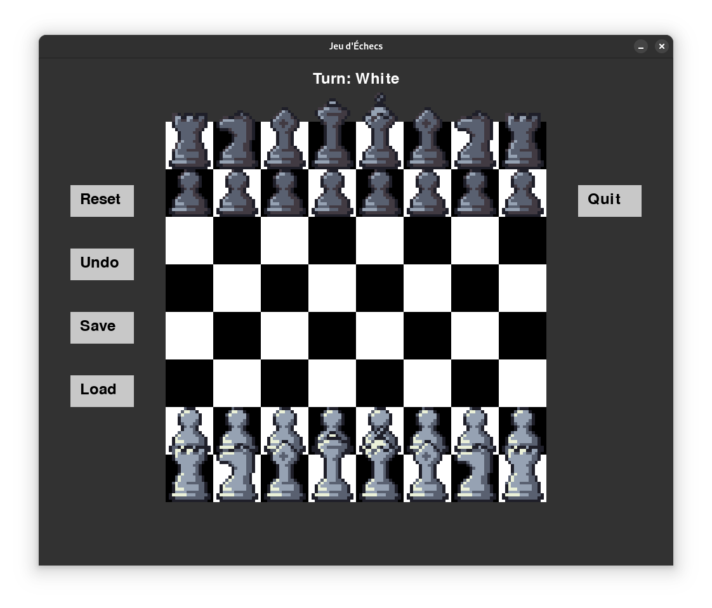

# Jeu d'échecs avec IA

Ce projet est un jeu d'échecs interactif, codé en Python, intégrant une IA capable de prendre des décisions stratégiques pour jouer contre un utilisateur humain. Le jeu utilise la bibliothèque `pygame` pour l'interface graphique et `python-chess` pour la logique d'échecs.

## Fonctionnalités

- **Interface graphique**
  - Dessin dynamique de l'échiquier.
  - Affichage des pièces avec des sprites personnalisés.
  - Surlignage des coups légaux.

- **Options de jeu**
  - Réinitialisation du plateau.
  - Annulation du dernier coup.
  - Indication du joueur en cours (Blanc ou Noir).

- **IA**
  - Calcul de la meilleure décision à l'aide d'une fonction d'évaluation et d'un algorithme de recherche.
  - Difficulté ajustable via la profondeur de recherche.

- **Animations**
  - Menu de promotion des pions.
  - Animation de victoire en cas de mat.
  - Indicateur de roi en échec.

- **Effets sonores**
  - Lecture d'un son à chaque coup.

## Prérequis

Avant de lancer le projet, assurez-vous d'avoir les éléments suivants installés :

- Python 3.7 ou version supérieure
- Pygame
- python-chess

Pour installer les dépendances, exécutez :

```bash
pip install pygame python-chess
```

Ou utilisez `conda` pour créer un environnement avec les dépendances :

```bash
conda create -c conda-forge --file conda_requirements.txt --name <env>
```

## Structure du projet

- **game/constants.py** : Contient les constantes comme la taille de la fenêtre, les couleurs, etc.
- **game/Ia.py** : Contient les fonctions pour évaluer le plateau et trouver les meilleurs coups pour l'IA.
- **sounds/sound.mp3** : Fichier audio joué lors des coups.
- **sprites/** : Dossier contenant les images des pièces (exemple : "white_queen.png").

## Lancer le jeu

Exécutez simplement le fichier principal pour lancer le jeu :

```bash
python main.py
```

## Utilisation

- Cliquez sur une pièce pour afficher ses coups possibles.
- Cliquez sur un bouton pour effectuer l'action correspondante :
  - **Reset** : Réinitialise le plateau.
  - **Quit** : Ferme le jeu.
  - **Undo** : Annule le dernier coup.
- Lorsque c'est au tour de l'IA, elle joue automatiquement.
- En cas de promotion de pion, choisissez la pièce souhaitée dans le menu qui s'affiche.

## Capture d'écran



## Contribution

Les contributions sont les bienvenues ! N'hésitez pas à proposer des modifications via des pull requests ou à signaler des problèmes dans la section Issues.

---

Merci de jouer à notre jeu d'échecs ! Nous espérons que vous apprécierez l'expérience.

